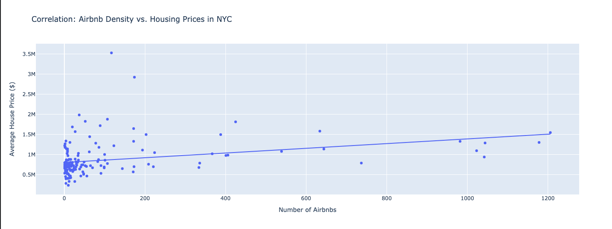

# The Airbnb Effect: Quantifying the Impact of Short-Term Rentals on NYC Housing Markets

## 📌 Project Overview
In the debate over urban housing affordability, "platformization"—the conversion of residential housing into short-term rentals via Airbnb—is often cited as a driver of rising costs. This project utilizes Computational Social Science techniques to empirically test this theory in New York City.

Using **Ordinary Least Squares (OLS) regression**, I analyzed the relationship between Airbnb density and Zillow Home Value Index (ZHVI) benchmarks across **164 NYC neighborhoods**.

## 🔍 Key Findings

* **Statistically Significant Correlation:** The model yielded a P-value of **0.000** ($p < 0.05$), confirming a non-random positive relationship between Airbnb density and housing prices.
* **The "Premium":** The regression coefficient ($\beta_1$) suggests that **each additional active Airbnb listing** in a neighborhood is associated with a **$585 increase** in average home values.
* **Predictive Power:** The model explains approximately **9.7%** ($R^2 = 0.097$) of the variance in housing prices, highlighting that while short-term rentals are a significant factor, they function alongside other variables like transit access and historic desirability.

## 🛠️ Methodology & Tech Stack
* **Language:** Python 3.9
* **Data Processing:** Pandas (ETL pipelines for merging disparate datasets).
* **Statistical Modeling:** Statsmodels (OLS Regression).
* **Visualization:** Plotly Express (Geospatial and scatter analysis).

## 📊 Data Sources
1.  **Inside Airbnb:** Granular listing data for NYC (Scraped 2024).
2.  **Zillow Research Data:** Smoothed, seasonally adjusted Home Value Index (ZHVI) by neighborhood.

## 📉 Analysis Breakdown
The project follows a rigorous data pipeline:
1.  **Ingestion:** Parsed raw CSV data (listings and time-series indices).
2.  **Normalization:** Mapped differing neighborhood taxonomies between Zillow and Airbnb datasets.
3.  **Econometrics:** Modeled the equation $Y = \beta_0 + \beta_1 X + \epsilon$, where $Y$ is Housing Price and $X$ is Airbnb Listing Count.

## 🚀 How to Run
1. Clone the repo:
   ```bash
   git clone [https://github.com/YOUR_USERNAME/nyc-airbnb-impact.git](https://github.com/YOUR_USERNAME/nyc-airbnb-impact.git)
